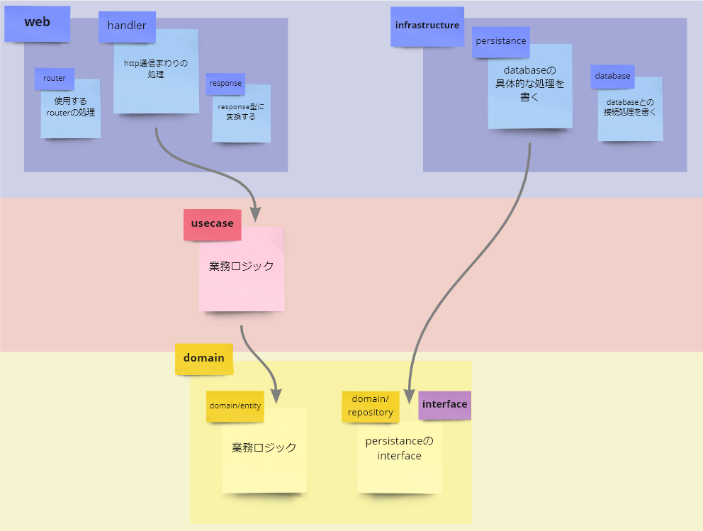

# アーキテクチャ

このアプリではCleanArchitectureを採用してます

## ディレクトリ構成

src配下の各ディレクトリ構成は以下の通りです

```
|--config           # portやdbとの接続先の情報を管理します
|--domain
|  |--entity        # ビジネスロジックを表現するオブジェクトを管理します
|  |--repository    # infrastructure/persistanceのインターフェースがあります
|--infrastructure
|  |--database      # 外部のdbと接続します
|  |--persistance   # domain/repositoryのインターフェースの具体的な実装があります
|--usecase          # エンティティのビジネスルールをいつどのように呼び出すか定義します
|--utils
|  |--helper        # アプリ全体で利用できるヘルパー関数があります
|--web
|  |--handler       # ハンドラーを管理します
|  |--router        # ルーティング処理を記述します
```

## 依存関係図

矢印は依存の方向を表しています

